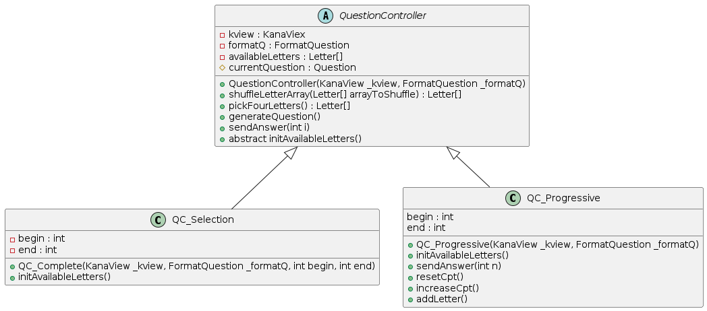

# Kana World

[](https://forthebadge.com)

## Présentation générale 
Ce projet est un jeu éducatif destiné à l'apprentissage des kanas (alphabet japonais). Cela consiste en un quiz dans lequel un caractère est montré avec 4 propositions de réponses. Le but est de retrouver la lettre correspondante. Le jeu propose plusieurs modes de jeux et formats de questions.  

## Script  

```bash
#Compiler
javac -sourcepath src -d bin src/Main.java 

#Générer le jar
jar cfe KanaWorld.jar Main -C bin ./

#Lancer le projet
java -jar KanaWorld.jar 
``` 

## Présentation détaillée
La langue japonaise dispose d'un système d'écriture complexe. Il est composé des Kanji (idéogrammes chinois) et des Kana (des syllabes). L'étude des kana est donc la première grande étape lors de l'apprentissage de la langue japonaise.

Les Kana sont composés de deux tableaux de caractères : les hiragana et les katakana, qui représentent une cinquantaine de caractères chacun.

- Tableau des Hiraganas


- Tableau des Katakanas


### Les modes de jeu

Ce projet propose 3 principaux modes de jeux : 
- **Mode Complet** : Tous les caractères sont en jeu
- **Mode Progressif** : Le jeu commence avec les premiers caractères (a, i, u, e, o) et ajoute un caractère toutes les 5 bonnes réponses consécutives (d'abord ka, puis ki, ku, ke, ko, sa, shi, ...) 
- **Mode Selectif** : L'utilisateur peut choisir une ligne de kana, par exemple (ta, chi, tsu, te, to) ou (na, ni, nu, ne, no) et le questionnaire tourne en boucle avec ces lettres.

### Les formats de question

Le jeu propose également différents formats de questions : 
- **Hiragana -> Romaji** : Le quiz propose un hiragana et 4 proposition en lettres alphabet, il faut retrouver la lettre correspondante.
- **Romaji -> Hiragana** : L'inverse, le quiz propose une lettre alphabet et propose 4 hiraganas.
- **Katakana -> Romaji** et **Alpha -> Katakana** : La même chose avec les katakanas
- **Kana -> Romaji** et **Alpha -> Kana** : La même chose, mais avec à la fois des hiraganas et des katakanas
- **Hiragana <-> Katakana** : Le quiz propose un caractère en hiragana ou en katakana, les propositions de réponses sont dans l'autre alphabet.

*Note : Rômaji vient de "Roma" (Rome) et "Ji" signifie "Caractère".*

## Présentation technique

Ce projet utilise un patron MVC (Model - View - Controller).

### Partie View

 L'interface (orienté objet) KanaView permet d'implémenter plusieurs interfaces graphiques à ce programme. Cette partie gère l'interaction avec l'utilisateur : elle affiche les informations, et les reçoit pour les envoyer au Controller.

La version graphique IGKana utilise Java Swing, elle affiche le caractère en question dans un label central, et les propositions de réponse dans 4 boutons alignés. Le clic d'un bouton qui envoit la réponse sélectionnée au reste du programme avec **clickButton(int n), n l'identifiant du bouton**. 

Lorsqu'une réponse est sélectionnée les boutons s'illuminent en rouge ou en vert pour indiquer la solution (avec **revealGoodAnswer()**). Pour ajouter un délai entre le moment de la solution et la question suivante j'utilise un thread car un **wait** classique interrompt le programme et donc le dessin du GUI. 


### Partie Model

Les lettres sont représentées par une classe **Letter** avec 3 champs String pour chacune des versions. Une classe abstraite **LetterFactory** contient un tableau de toutes les lettres. 

Pour les questions, une classe comporte une **askedLetter** et un tableau de réponses **answers**.

Enfin, la partie modèle comporte les différents formats de question. Ils comportent chacun une méthodes **getfAskedLetter()** et **getfAnswers()** permettant de récupérer un String de la lettre formatée selon le format de question choisi.


### Partie Controller

Les Controller représentent les modes de jeu. Ils comportent un tableau de lettres à questionner et des méthodes pour générer des questions et en analyser les réponses. Le Controller communique avec une View pour intéragir avec l'utilisateur. 


